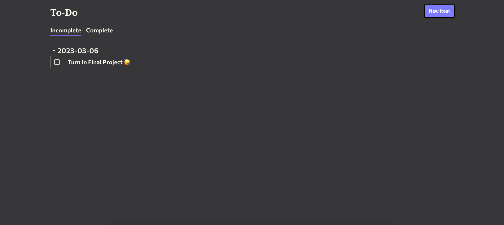

# To-Do ✅



## Before You Start

### Basic Functionality

This is a To-Do application that allows a user to create, read, edit, and complete To-Do items.

### Technology Choices

- Frontend
  - React
  - Next.js
  - Sass
  - MaterialUI
  - Formik/Yup
  - Axios
- API
  - FastAPI
  - SQLAlchemy
- Database
  - Postgres
  - Alembic
  - SQLAlchemy

### Containerization

I chose to containerize the application so that I can make sure it runs consistently. For instance, I wanted to make sure that my version of Node (`v19`) is applied when running the application due to compatibility issues between sass and older versions.

There are four containers:

1. Web - The frontend of the application
2. API - The backend of the application
3. Postgres - The database
4. Migration - The service which applies our migrations to the database

## Getting Started

### Running the Application

The following make command should make it easy to get the application running:

```bash
make up-all
```

It may take a couple of minutes to build, migrate, etc., but once the script is finished the application should be accessible in your browser at http://localhost:3000.

If, for some reason, a service dies, you can recreate it with this make command:

```bash
make up-service service=<service_name_here>
```


## Things I'm Proud Of

- **Mobile-First Design 📱** - The frontend was built on mobile, with the desktop spacing coming later. As a result, it's completely responsive.
- **Due Dates 📆** - I added in due dates because it seemed like a fun challenge and I really like how it turned out. It also gave me the chance to play with the experimental new MaterialUI features.
- **Overall Design 🎨** - The functionality is relatively straightforward, but I like the way the theme turned out - especially the collapsible task groups.
- **Containerization 🐳** - I was concerned since I updated a few packages to the most recent versions, but containerizing the application (should) make it more consistent.

## Room for Improvement

- **Testing 🧪** - I would have preferred to write unit tests for the API and the frontend. Due to time constraints, I chose not to.
- **Form Validation 👀** - I used `Formik` with `Yup` for validation, but it's entirely possible that the form breaks given an unexpected input. 
- **Cleanup 🧹** - There are definitely some opportunities for cleanup. I was originally planning on allowing for `Tags` to go along with `Tasks`, so there are references to `Tags` in some places. Similarly, I duplicated my `models.py` rather than messing with Python paths or passing the file around between containers.